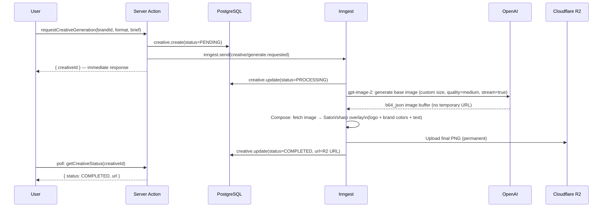
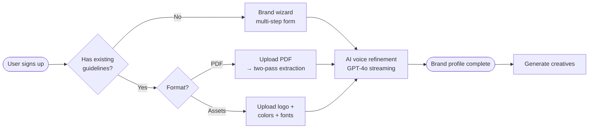

# feat: Brand Alchemist — SaaS brand identity and on-brand creative generation

## Summary

A web-based SaaS platform for marketers and small business owners to define, store, and generate on-brand social media content. Users sign up with Clerk, build brand guidelines via a guided wizard or by uploading an existing document, and then generate AI-powered creatives (Instagram square/story, LinkedIn post/banner) that embed their logo, colors, fonts, and brand voice. The stack is Next.js 14 (App Router) + TypeScript, PostgreSQL + Prisma, Clerk auth, Cloudflare R2 storage, OpenAI (GPT-4o + gpt-image-2), Inngest for async jobs, deployed to Vercel.

---

## Problem Frame

Marketers and small business owners struggle to produce consistent, on-brand social content. Professional tools like Canva require design skill and constant upfront configuration; AI image tools produce beautiful visuals that look nothing like the brand. Brand guidelines live in PDFs or people's heads but never connect to the content being created.

**This tool solves the translation layer**: define your brand once, generate on-brand creatives forever.

**Primary actors:**
- **Marketer / Small business owner** — creates brand profile, uploads guidelines, generates and downloads creatives
- **OpenAI (GPT-4o)** — extracts brand elements from PDFs and refines brand voice copy
- **OpenAI (gpt-image-2)** — generates base images for social media creatives (DALL-E 3 was retired May 12, 2026)
- **Inngest** — orchestrates the async creative generation job (prompt → gpt-image-2 → compose → upload)

---

## Requirements

**Brand Profile**
- R1: A user can create a brand profile via a multi-step wizard collecting: brand name, description, logo, primary/secondary/accent colors, heading font, body font, tone-of-voice keywords, and tagline
- R2: A user can upload an existing brand guidelines PDF; the system extracts brand elements automatically
- R3: A user can upload individual brand assets (logo image, font files, color swatches) directly without a PDF
- R13: A user can provide a website URL; the system scrapes the site's visual identity (colors, fonts, logo, tone) and pre-fills the brand profile automatically
- R4: Brand profile fields are editable after creation
- R5: Brand data persists to the authenticated user's account and is never shared across users

**Creative Generation**
- R6: A user selects a creative format (Instagram square, Instagram story, LinkedIn post, LinkedIn banner) and provides a content brief (optional)
- R7: The system builds a brand-aware prompt incorporating the stored brand colors, style keywords, and tone, then calls `gpt-image-2` for the base image
- R8: The generated creative is composited with the brand logo overlay, color accents, and any text (headline, tagline) using server-side image processing
- R9: Generated creatives are stored in Cloudflare R2 and accessible to the user from an asset library
- R10: Creative generation runs asynchronously; the user sees status (pending → processing → completed) without page blocking

**Auth & Accounts**
- R11: Users authenticate via Clerk (email/password + social login)
- R12: User records are synced to PostgreSQL via a Clerk webhook on create/update/delete

---

## Key Technical Decisions

**0. AI image model: `gpt-image-2` (not DALL-E 3)**

DALL-E 3 was retired on May 12, 2026. All image generation uses `gpt-image-2`, which supports custom dimensions (both axes must be divisible by 16; aspect ratio must be between 1:3 and 3:1). This means exact social media pixel dimensions need a `sharp` post-processing step. Set `quality: 'medium'` as the default; enable `stream: true` with `partial_images: 2` on all medium/high quality calls to prevent gateway timeouts (generation takes 20–40 seconds at medium quality). Always return `b64_json` — `gpt-image-2` does not return temporary URLs like DALL-E did.

**1. Creative image composition: Satori (`@vercel/og`) as primary, `sharp` + `@napi-rs/canvas` as upgrade path**

Satori converts React JSX + CSS to SVG → PNG, runs natively in Vercel Edge runtime with ~50–200ms latency, and supports custom TTF/OTF fonts. Its CSS limitations (no `z-index`, no CSS Grid, no arbitrary blending) are workable for structured social card templates with a background image + logo corner + text block layout. For launch, Satori covers the four required formats. `sharp` + `@napi-rs/canvas` is the upgrade path when users need complex layering or exact brand font rendering at pixel level — both work on Vercel serverless with `serverExternalPackages` exclusion.

`puppeteer` / headless Chrome is explicitly deferred: 1–3s cold starts and Vercel bundle size constraints make it a poor choice before product-market fit is established.

**2. Website brand extraction: two-pass hybrid (CSS scraping + screenshot vision)**

Extracting brand identity from a URL uses two complementary passes run as an Inngest function:

Pass 1 — Structural scraping (`node-fetch` + `cheerio` + `csstree`): fetch the page HTML, parse `<link rel="stylesheet">` and `<style>` tags, extract all `color`, `background-color`, and `font-family` CSS declarations, and harvest Open Graph metadata (`og:image` for logo candidate, `og:site_name` for brand name, `og:description` for tagline seed) plus the text of `h1`, `h2`, `nav`, and footer elements for tone analysis. Cheap and fast — no external API call.

Pass 2 — Screenshot + GPT-4o Vision: take a screenshot via the **Microlink API** (`api.microlink.io/screenshot?url=...`) — a REST call requiring no auth key at the free tier (250 req/day). Pass the screenshot PNG to GPT-4o with a structured JSON schema prompt for `{primaryColors, secondaryColors, fonts, toneKeywords, logoPresent, logoDescription}`. This catches visual brand palette choices that aren't in the CSS (e.g., hero image colors, illustration palette) and validates the structural scraping results.

Merge results using the same deduplication approach as PDF extraction. Puppeteer via `@sparticuz/chromium-min` is the self-hosted upgrade path if Microlink rate limits become a constraint.

**Constraint:** Sites built as fully client-rendered SPAs (React/Vue with no SSR) will return near-empty HTML on a `node-fetch` pass. The screenshot pass compensates because Microlink renders the full page via headless Chrome before capturing. Note this in the UI: "Best results from sites with server-rendered or static pages; the screenshot pass covers most modern SPAs."

**3. PDF brand extraction: two-pass hybrid with OpenAI Files API**

Pass 1 — `pdf.js-extract` (structural): extracts text content, font names, and inline text colors cheaply without a network call. Catches explicit hex codes written in the document and font name strings.

Pass 2 — GPT-4o Vision (visual): upload the PDF once via `openai.files.create({ purpose: 'user_data' })`, store the returned `file_id` in `BrandGuideline`, then call GPT-4o with the `file_id` reference and a structured JSON schema prompt for `{colors, fonts, taglines, values, voiceKeywords}`. The Files API handles page rendering server-side — no need to render PDF pages to PNG manually. Max 50MB / 100 pages. Reuse the `file_id` across sessions to avoid re-uploading.

Adobe PDF Extract API is an explicit alternative for paying users if extraction accuracy falls short — it handles complex, designed PDFs (exactly the brand guidelines format) and offers 500 free transactions/month.

**3. Async creative generation: Inngest**

DALL-E 3 generation takes 10–30 seconds. Vercel Pro functions cap at 60 seconds; Hobby at 10 seconds. Inngest's step-function model retries each step independently — a failed R2 upload does not re-run the `gpt-image-2` call. The Vercel integration auto-registers on deploy with no separate infrastructure. Free tier covers 50,000 runs/month; Pro is $20/month at 1M runs.

**4. File storage: Cloudflare R2**

R2 is S3-API-compatible (AWS SDK works unchanged). Zero egress fees vs AWS S3's $0.09/GB — decisive for a media-heavy SaaS where users frequently download generated creatives. Presigned PUT URLs bypass the Vercel function body size limit (4.5MB cap) for brand PDF uploads and asset files.

**5. Auth sync: Clerk webhook DAL pattern**

Clerk's middleware protects routes, but every server-side data access also calls `await auth()` via a Data Access Layer (DAL) helper — middleware alone is not sufficient security. User rows in PostgreSQL are created/updated/deleted via a Clerk webhook (`user.created`, `user.updated`, `user.deleted`) to maintain a reliable foreign key for brand ownership.

---

## High-Level Technical Design

### System Architecture

```mermaid
graph TD
    Client["Browser\n(Next.js RSC + Client Components)"]
    Clerk["Clerk\n(Auth Provider)"]
    Server["Next.js App\n(App Router / Vercel)"]
    DB[("PostgreSQL\n(Prisma ORM)")]
    R2["Cloudflare R2\n(File Storage)"]
    Inngest["Inngest\n(Job Queue)"]
    OpenAI["OpenAI\n(GPT-4o + gpt-image-2)"]

    Client -->|sign-in / sign-up| Clerk
    Clerk -->|webhook: user.created| Server
    Client -->|Server Actions, RSC fetches| Server
    Server -->|prisma queries| DB
    Server -->|presigned PUT URL issued| Client
    Client -->|direct upload| R2
    Server -->|inngest.send()| Inngest
    Inngest -->|gpt-image-2 generate| OpenAI
    Inngest -->|GPT-4o vision / text| OpenAI
    Inngest -->|upload composed creative| R2
    Inngest -->|update creative status| DB
    Client -->|poll creative status| Server
```

### Creative Generation Flow



### Brand Setup Flows



---

## Output Structure

```
brand-alchemist-prakel/
├── app/
│   ├── (auth)/
│   │   ├── sign-in/[[...sign-in]]/
│   │   └── sign-up/[[...sign-up]]/
│   ├── (dashboard)/
│   │   ├── layout.tsx                  # DAL auth gate
│   │   ├── page.tsx                    # dashboard home
│   │   ├── brands/
│   │   │   ├── new/
│   │   │   │   └── page.tsx            # wizard entry
│   │   │   └── [id]/
│   │   │       ├── page.tsx            # brand profile view
│   │   │       ├── edit/page.tsx
│   │   │       └── creatives/
│   │   │           ├── page.tsx        # asset library
│   │   │           └── new/page.tsx    # generation request
│   ├── api/
│   │   ├── inngest/route.ts
│   │   └── webhooks/clerk/route.ts
│   ├── actions/
│   │   ├── brand.ts
│   │   ├── brand-assets.ts
│   │   ├── upload.ts
│   │   └── creatives.ts
│   └── inngest/
│       ├── generate-creative.ts
│       ├── extract-pdf-brand.ts
│       └── extract-website-brand.ts
├── components/
│   ├── brand-wizard/
│   ├── creative-card/
│   └── upload/
├── lib/
│   ├── prisma.ts
│   ├── inngest.ts
│   ├── dal.ts
│   ├── openai.ts
│   ├── r2.ts
│   └── db/
│       ├── brands.ts
│       └── creatives.ts
├── prisma/
│   └── schema.prisma
└── middleware.ts
```

---

## Implementation Units

### U1. Project scaffold and infrastructure

**Goal:** Bootstrapped Next.js 14 App Router project with all core dependencies installed, environment wiring, and CI configured.

**Requirements:** Foundation for R1–R12.

**Dependencies:** None.

**Files:**
- `package.json`
- `next.config.ts`
- `middleware.ts`
- `.env.example`
- `prisma/schema.prisma`
- `lib/prisma.ts`
- `lib/inngest.ts`
- `lib/openai.ts`
- `lib/r2.ts`
- `lib/dal.ts`

**Approach:**
- Bootstrap with `create-next-app` using the App Router + TypeScript template
- Install core deps: `@clerk/nextjs`, `@prisma/client`, `prisma`, `inngest`, `openai`, `@aws-sdk/client-s3`, `@aws-sdk/s3-request-presigner`, `zod`, `@vercel/og`
- Install dev deps: `@types/node`, `tsx`, `prisma`
- `next.config.ts`: add `serverExternalPackages: ['@napi-rs/canvas', 'sharp']` (for future Tier 2 composition), configure image domains for R2 (gpt-image-2 returns b64_json, no external URLs to allowlist)
- `lib/prisma.ts`: singleton Prisma client with `globalThis` guard to prevent connection exhaustion on hot reload
- `lib/dal.ts`: `getCurrentUser()` using `cache()` from React + Clerk's `auth()`, throws if unauthenticated; used in every server-side data access
- `lib/r2.ts`: S3Client configured for Cloudflare R2 endpoint (`https://<CF_ACCOUNT_ID>.r2.cloudflarestorage.com`), shared across upload helpers and Inngest functions
- `lib/openai.ts`: OpenAI client singleton
- `lib/inngest.ts`: Inngest client with app ID `brand-alchemist`
- `.env.example`: documents all required env vars (see Key Env Vars below)
- `middleware.ts`: `clerkMiddleware()` with `createRouteMatcher()` protecting all routes except `/`, `/sign-in(.*)`, `/sign-up(.*)`, `/api/webhooks/clerk`

**Key env vars:**
```
NEXT_PUBLIC_CLERK_PUBLISHABLE_KEY
CLERK_SECRET_KEY
CLERK_WEBHOOK_SIGNING_SECRET
NEXT_PUBLIC_CLERK_SIGN_IN_URL=/sign-in
NEXT_PUBLIC_CLERK_SIGN_UP_URL=/sign-up
NEXT_PUBLIC_CLERK_AFTER_SIGN_IN_URL=/dashboard
NEXT_PUBLIC_CLERK_AFTER_SIGN_UP_URL=/onboarding
DATABASE_URL                  # Neon/Supabase with ?pgbouncer=true&connection_limit=1
OPENAI_API_KEY
CF_ACCOUNT_ID
R2_ACCESS_KEY_ID
R2_SECRET_ACCESS_KEY
R2_BUCKET_NAME
R2_PUBLIC_URL                 # public bucket URL for serving assets
INNGEST_SIGNING_KEY
INNGEST_EVENT_KEY
```

**Patterns to follow:** Next.js 14 App Router conventions, Prisma singleton pattern.

**Test scenarios:**
- `npm run dev` starts without errors; `/` is accessible unauthenticated
- `/dashboard` redirects to `/sign-in` when unauthenticated
- `prisma db push` creates tables without errors against a local PostgreSQL instance
- All required env vars are documented in `.env.example`

**Verification:** Dev server starts, middleware redirects unauthenticated users, Prisma client connects.

---

### U2. Clerk auth and user sync

**Goal:** Working sign-up/sign-in UI (Clerk-hosted components) plus a webhook that syncs Clerk user events to a PostgreSQL `User` row, providing a stable FK for all user-owned data.

**Requirements:** R11, R12.

**Dependencies:** U1.

**Files:**
- `app/(auth)/sign-in/[[...sign-in]]/page.tsx`
- `app/(auth)/sign-up/[[...sign-up]]/page.tsx`
- `app/api/webhooks/clerk/route.ts`
- `prisma/schema.prisma` (User model)

**Approach:**
- Auth pages: render Clerk's `<SignIn />` and `<SignUp />` components; Clerk handles OAuth and email/password flows
- Webhook handler at `/api/webhooks/clerk`:
  - Call `verifyWebhook(req)` from `@clerk/nextjs/webhooks` (reads `CLERK_WEBHOOK_SIGNING_SECRET` automatically)
  - Handle `user.created` → `prisma.user.upsert` on `clerkId`
  - Handle `user.updated` → update `email` and `name`
  - Handle `user.deleted` → `prisma.user.delete`
  - Return `200 OK` after each; return `400` with reason on signature failure
- Webhook must be in the public route matcher in `middleware.ts`
- Register events `user.created`, `user.updated`, `user.deleted` in the Clerk dashboard pointing to `<prod-url>/api/webhooks/clerk`; use the Clerk CLI for local dev tunneling

**Test scenarios:**
- Sign up with email creates a `User` row in PostgreSQL with matching `clerkId`
- Updating name/email in Clerk dashboard updates the `User` row (via webhook)
- Deleting a Clerk user cascades to deleting the `User` row
- Sending a webhook request with an invalid signature returns 400
- `getCurrentUser()` in a Server Action for an authenticated user returns the correct `userId`; throws for unauthenticated

**Verification:** Full sign-up flow produces a `User` row; protected routes accessible after sign-in.

---

### U3. Brand data model

**Goal:** Prisma schema defining all tables for the brand identity system: `Brand`, `BrandAsset`, `BrandGuideline`, `Creative`, and supporting enums.

**Requirements:** R1–R10.

**Dependencies:** U1.

**Files:**
- `prisma/schema.prisma`
- `lib/db/brands.ts`
- `lib/db/creatives.ts`

**Approach:**

Schema key points:
- `Brand` owned by `userId` (FK to `User`); every query in `lib/db/brands.ts` includes `where: { id, userId }` — no query returns a brand without verifying ownership (prevents IDOR)
- `BrandAsset`: stores references (R2 URL + object key) for logos, font files, PDF guidelines, and reference images. Type enum: `LOGO | FONT | PDF_GUIDELINES | REFERENCE_IMAGE`
- `Creative`: tracks generation job status (`PENDING | PROCESSING | COMPLETED | FAILED`), stores the Inngest job ID, final R2 URL, format enum (`INSTAGRAM_SQUARE | INSTAGRAM_STORY | LINKEDIN_POST | LINKEDIN_BANNER`), and the prompt used
- `@@index([userId])` on `Brand`, `@@index([brandId])` on all child tables — critical for tenant-scoped query performance

Scoped query helpers in `lib/db/brands.ts`:
- `getBrands(userId)` — returns all brands for the user
- `getBrand(brandId, userId)` — returns one brand, throws opaque "not found" if id+userId doesn't match (same error for "not found" and "wrong tenant")
- `updateBrand(brandId, userId, data)` — scoped update

Never return different errors for "not found" vs "wrong tenant" — that leaks other users' data existence.

**Test scenarios:**
- Migrations apply cleanly to a fresh PostgreSQL database
- `getBrand(brandId, wrongUserId)` throws rather than returning another user's brand
- `Creative` status enum transitions are enforced at the DB level (Prisma enum)
- `onDelete: Cascade` on `Brand.userId` deletes all child rows when a user is deleted

**Verification:** `prisma migrate dev` completes; schema reflects all tables and indexes.

---

### U4. Brand guidelines wizard

**Goal:** Multi-step form UI that walks users through creating a brand profile from scratch. Each step is a server-rendered form with Server Action mutations.

**Requirements:** R1, R4.

**Dependencies:** U2, U3.

**Files:**
- `app/(dashboard)/brands/new/page.tsx`
- `app/(dashboard)/brands/new/WizardShell.tsx` (client component — tracks step state)
- `components/brand-wizard/Step1Identity.tsx` (brand name, description, tagline)
- `components/brand-wizard/Step2Colors.tsx` (primary, secondary, accent — hex input + color picker)
- `components/brand-wizard/Step3Typography.tsx` (heading font, body font — text input with Google Fonts preview)
- `components/brand-wizard/Step4Tone.tsx` (tone-of-voice checkboxes: professional, friendly, bold, playful, luxurious, etc.)
- `components/brand-wizard/Step5Logo.tsx` (logo upload — triggers U6 presigned URL flow)
- `app/actions/brand.ts`

**Approach:**
- `WizardShell` is a Client Component that manages current step index and accumulated form state (held in `useState` across steps — no server round-trip per step until submission)
- Final step submits all accumulated state to a `createBrand` Server Action:
  - Validates with Zod: `name` required, colors must be valid hex or empty, tone array max 5 items
  - Calls `getCurrentUser()` first — never trust client-provided userId
  - `prisma.brand.create()` with all fields; returns `{ brandId }` to redirect to brand profile
  - Calls `revalidatePath('/dashboard')` after creation
- Color input: HTML `<input type="color">` for picker + text input for manual hex entry, synced bidirectionally
- Logo upload in Step 5: client uploads via presigned URL (U6); on success, stores the R2 key in wizard state and sends it to `createBrand` as `logoKey`

**Test scenarios:**
- Completing all 5 steps and submitting creates a `Brand` row with all fields populated
- Submitting with only `name` (all optional fields empty) succeeds and creates a minimal brand
- Submitting an invalid hex color (e.g., `#ZZZ`) returns a validation error without data loss to other steps
- Navigating back between steps preserves previously entered data
- Unauthenticated POST to `createBrand` action throws / returns 401
- A user cannot create a brand attributed to another user's `userId` (userId always comes from `getCurrentUser()`, not the form)

**Verification:** Full wizard flow creates a brand visible on the dashboard.

---

### U5. AI brand voice refinement

**Goal:** After the wizard (or any brand edit), a GPT-4o call takes the user's raw tone keywords, tagline, and description and returns polished, actionable brand voice guidance. Output streams to the UI.

**Requirements:** R1 (enhances wizard output quality).

**Dependencies:** U3, U4.

**Files:**
- `app/actions/ai-refine.ts`
- `components/brand-wizard/Step4Tone.tsx` (adds "Refine with AI" button)
- `app/(dashboard)/brands/[id]/edit/page.tsx` (also surfaces refinement)

**Approach:**
- Server Action `refineBrandVoice(brandId: string)`:
  - `getBrand(brandId, userId)` — ownership check
  - Reads current `tone`, `description`, `tagline` from the brand record
  - Calls GPT-4o via the Vercel AI SDK `streamText()` with a prompt like: _"You are a brand strategist. Given these brand inputs: [tone keywords, description, tagline], write a concise 2-3 sentence brand voice guide that tells a content creator how to sound when writing captions and social media posts for this brand."_
  - Returns a streamable value via `createStreamableValue` from `ai/rsc`
  - On stream completion, client POSTs the final text back to `saveBrandVoice(brandId, voiceText)` Server Action to persist it in `Brand.voiceGuide` (text field)
- The refinement is opt-in — the user clicks "Refine with AI", sees the streamed result in a preview panel, and can edit before saving

**Test scenarios:**
- `refineBrandVoice` with a populated brand returns a non-empty streamed text response
- Calling `refineBrandVoice` for a brand not owned by the user throws (ownership check fires)
- Streamed output stops within 30 seconds (GPT-4o latency guard)
- User can edit the streamed suggestion before saving it
- Saving the refined voice updates `Brand.voiceGuide` in the DB

**Verification:** Clicking "Refine with AI" streams GPT-4o output visibly in the UI; final text persists to the brand record.

---

### U6. File upload pipeline

**Goal:** Shared infrastructure for all user-initiated file uploads (logo, font, PDF guidelines). Issues presigned R2 PUT URLs from a Server Action, handles client-side upload, and saves the asset reference to `BrandAsset`.

**Requirements:** R1, R2, R3.

**Dependencies:** U2, U3.

**Files:**
- `app/actions/upload.ts`
- `app/actions/brand-assets.ts`
- `components/upload/FileUploader.tsx` (client component — drag-and-drop + progress)
- `lib/r2.ts`

**Approach:**
- `getUploadUrl(fileName, contentType, sizeBytes, brandId)` Server Action:
  - Auth and ownership check first (`getBrand(brandId, userId)`)
  - Validate: `contentType` must be in allowlist (`image/jpeg`, `image/png`, `image/svg+xml`, `application/pdf`, `font/ttf`, `font/otf`); `sizeBytes` ≤ 20MB
  - Generate object key: `${userId}/${brandId}/${nanoid()}-${fileName}` (user-namespaced, prevents path traversal)
  - Call `getSignedUrl(r2, PutObjectCommand, { expiresIn: 300 })` — 5-minute window
  - Return `{ url, key }`
- `FileUploader` client component:
  1. Calls `getUploadUrl` to get presigned URL
  2. PUTs file directly to R2 with `fetch` (bypasses Vercel function body limit)
  3. On success, calls `saveBrandAsset(brandId, key, type, mimeType, sizeBytes)` Server Action
  4. Shows upload progress via `XMLHttpRequest` with `upload.onprogress`
- `saveBrandAsset` Server Action: ownership check → `prisma.brandAsset.create()`
- R2 CORS must be configured (AllowedOrigins: dev + prod, AllowedMethods: `PUT GET`)

**Test scenarios:**
- Uploading a PNG logo completes and creates a `BrandAsset` row with correct `type: LOGO`
- Attempting to upload a `.exe` file returns a validation error before any presigned URL is issued
- Attempting to upload a 25MB file returns a size validation error
- A presigned URL generated for user A cannot be used by user B (R2 enforces the signature; the key is user-namespaced)
- File upload progress is visible to the user during upload

**Verification:** Uploaded file appears in R2 dashboard; `BrandAsset` row created; file accessible via `R2_PUBLIC_URL/<key>`.

---

### U7. Brand guidelines upload and extraction

**Goal:** Three paths for importing existing brand guidelines into the system — PDF upload with AI extraction, structured asset upload, and website URL scanning. All three populate the same `Brand` fields and feed into an editable preview before committing.

**Requirements:** R2, R3, R13.

**Dependencies:** U3, U6.

**Files:**
- `app/(dashboard)/brands/new/upload/page.tsx` (upload landing — choose PDF, URL, or structured)
- `components/upload/PdfUploadExtractor.tsx`
- `components/upload/WebsiteUrlExtractor.tsx`
- `components/upload/StructuredAssetUpload.tsx`
- `app/actions/extract-brand-pdf.ts`
- `app/actions/extract-brand-website.ts`
- `app/inngest/extract-pdf-brand.ts` (Inngest function for async PDF extraction)
- `app/inngest/extract-website-brand.ts` (Inngest function for async website extraction)

**Approach:**

**PDF path:**
- User uploads PDF via `FileUploader` (U6) — stored in R2 as `BrandAsset` type `PDF_GUIDELINES`
- After upload, client calls `triggerPdfExtraction(brandId, assetKey)` Server Action
- Server Action creates a `BrandGuideline` row with `status: PENDING`, sends Inngest event `brand/pdf.extract.requested`
- Inngest function `extractPdfBrand`:
  - Step 1 — `pdf.js-extract` pass: fetch PDF from R2, run `pdf.js-extract` with `includeColors: true`, collect all text, font names, and inline text colors
  - Step 2 — GPT-4o Vision pass: upload PDF to OpenAI Files API (`openai.files.create({ purpose: 'user_data' })`), store `file_id` on `BrandGuideline`, call GPT-4o with the `file_id` reference and JSON schema: `{ colors: [{hex, name, usage}], fonts: [{name, usage}], taglines: string[], values: string[], voiceKeywords: string[] }`
  - Step 3 — Merge results: union colors from both passes (deduplicate by hex similarity within 5%), prefer Vision results for colors, structural results for font names and text
  - Step 4 — `prisma.brand.update()` with extracted fields; set `BrandGuideline.status: COMPLETED`
- UI polls extraction status; shows extracted fields in an editable preview before saving

**Website URL path:**
- User inputs a URL in `WebsiteUrlExtractor` — validated client-side as a well-formed `https://` URL
- On submit, `triggerWebsiteExtraction(brandId, url)` Server Action:
  - Validates URL: must be `https://`, not a private IP range (SSRF protection — reject `localhost`, `127.x`, `10.x`, `192.168.x`, `172.16–31.x`)
  - Stores URL on the `Brand` record (`sourceUrl` field)
  - Creates a `BrandGuideline` row with `status: PENDING`, sends Inngest event `brand/website.extract.requested`
- Inngest function `extractWebsiteBrand`:
  - Step 1 — Structural scraping: `node-fetch` the URL, parse HTML with `cheerio`; fetch linked stylesheets; parse all CSS with `csstree` to collect `color`, `background-color`, and `font-family` declarations; harvest `og:image` (logo candidate), `og:site_name`, `og:description`, and text from `h1`, `h2`, `nav`, `footer` elements for tone seeds
  - Step 2 — Screenshot + Vision: call Microlink API (`https://api.microlink.io/screenshot?url=<url>&overlay.browser=false`) to get a rendered screenshot PNG; download it; send to GPT-4o Vision with JSON schema `{ primaryColors: [{hex, name}], secondaryColors: [{hex}], fonts: [{name, usage}], toneKeywords: string[], logoPresent: boolean, tagline: string }`
  - Step 3 — Merge: union CSS colors with Vision colors (deduplicate within 5% hex distance); prefer Vision results for primary palette; use structural results for font names; populate brand tone from Vision `toneKeywords`
  - Step 4 — `prisma.brand.update()` with extracted fields; set `BrandGuideline.status: COMPLETED`
- UI polls extraction status; shows extracted fields in editable preview before saving — same preview component reused across all three paths

**Structured asset path:**
- Form fields: logo file (via FileUploader), up to 5 hex color inputs, up to 2 font names (text input), tone keywords (checkboxes), tagline (text input)
- Submits to `saveStructuredBrand(brandId, data)` Server Action with Zod validation
- Directly updates `Brand` fields — no async job needed

**Patterns to follow:** Same polling pattern as PDF extraction; same editable preview component used by all three paths to keep the post-extraction UX consistent.

**Test scenarios:**
- Uploading a brand guidelines PDF triggers Inngest extraction job (verify event fires)
- PDF extraction completes and populates `Brand.primaryColor`, `Brand.fontHeading`, and `Brand.voiceGuide` with non-empty values from a well-formed PDF
- PDF extraction from a PDF with no machine-readable colors still extracts tone text from the Vision pass
- Submitting a valid `https://` website URL triggers Inngest extraction job (verify event fires)
- Website extraction for a server-rendered site (e.g., a standard marketing page) populates colors, fonts, and tone keywords
- Website extraction for a client-rendered SPA site still returns colors and tone via the Microlink screenshot + Vision pass (structural pass may be sparse)
- Submitting a URL with a private IP (`http://192.168.1.1`) is rejected with a validation error before any Inngest event fires (SSRF guard)
- Submitting a `http://` (non-HTTPS) URL is rejected at validation
- Microlink screenshot step timeout (mocked) retries the step without re-running the structural scraping step
- Structured asset upload with all fields populated correctly maps to `Brand` record
- Structured upload with only a logo (all other fields empty) succeeds
- Invalid hex color in structured upload returns validation error
- All three paths reach the same editable preview UI with extracted fields populated

**Verification:** After website extraction completes, brand profile shows pre-filled fields extracted from the target site; user can edit and save.

---

### U8. Brand profile dashboard

**Goal:** The central view for a brand — shows all brand identity fields, asset previews, and provides editing affordances. Serves as the hub before creative generation.

**Requirements:** R4, R5.

**Dependencies:** U3, U4, U5, U6, U7.

**Files:**
- `app/(dashboard)/brands/[id]/page.tsx` (server component — fetches brand + assets)
- `app/(dashboard)/brands/[id]/edit/page.tsx`
- `components/brand-wizard/` (reused step components in edit mode)
- `app/actions/brand.ts` (`updateBrand` action)

**Approach:**
- Brand profile page is a Server Component: calls `getBrand(brandId, userId)` (throws if not found / not owner), renders brand data directly — no client-side fetch
- Shows: brand name, description, color swatches (rendered via inline `div` with `backgroundColor`), font names, tone keywords, voice guide, logo thumbnail, uploaded assets list
- Edit link navigates to `/brands/[id]/edit` — same wizard step components rendered in "edit" mode with pre-filled values
- `updateBrand` Server Action: Zod validation → `getBrand` ownership check → `prisma.brand.update()`; calls `revalidatePath('/brands/[id]')` after update
- Logo and font file assets shown from `BrandAsset` rows; displayed as thumbnail (logo) or filename (fonts)
- "Generate Creative" CTA button links to `/brands/[id]/creatives/new`

**Test scenarios:**
- Brand profile page for brand owned by current user renders all fields
- Accessing `/brands/[id]` for a brand owned by a different user returns 404 (not 403 — same opaque error)
- Editing the brand name and saving reflects the new name on the profile page without a hard refresh
- Color swatches render with the correct hex background colors
- PDF extraction status indicator shows "Extracting..." while Inngest job is in progress; disappears on completion

**Verification:** Brand profile shows accurate, persisted data; edits save and reflect immediately.

---

### U9. Creative generation request

**Goal:** UI and server-side logic for initiating a creative generation job — format selection, optional content brief, brand-aware prompt construction, Inngest dispatch, and immediate status response.

**Requirements:** R6, R7, R10.

**Dependencies:** U3, U8.

**Files:**
- `app/(dashboard)/brands/[id]/creatives/new/page.tsx`
- `components/creative-card/FormatSelector.tsx`
- `app/actions/creatives.ts` (`requestCreativeGeneration`)
- `lib/prompts.ts` (brand-aware prompt builder)

**Approach:**
- Format selector: 4 cards showing each format with example dimensions and a preview thumbnail of the aspect ratio
- Optional content brief: text input for what the creative should communicate (e.g., "Summer sale — 30% off all products")
- On submit, `requestCreativeGeneration(brandId, format, brief)` Server Action:
  1. `getBrand(brandId, userId)` — ownership + auth
  2. `buildPrompt(brand, format, brief)` — assembles gpt-image-2 prompt:
     - Style: "professional marketing creative, social media post, brand consistent"
     - Colors: "primary color #HEXHEX, secondary color #HEXHEX, use these as dominant palette"
     - Tone: incorporates brand voice keywords
     - Format context: "vertical portrait aspect ratio" for stories, "horizontal wide" for LinkedIn banner
     - Brief: appended verbatim if provided
  3. `prisma.creative.create(status: PENDING, prompt, format, brandId)`
  4. `inngest.send('creative/generate.requested', { creativeId, brandId, format, prompt })`
  5. Returns `{ creativeId }` — client redirects to `/brands/[id]/creatives/[creativeId]` status page
- No waiting on the Inngest job — response is immediate
- Status page (U12) polls the `creativeId` for status updates

**Test scenarios:**
- Submitting the form creates a `Creative` row with `status: PENDING`
- Inngest receives the `creative/generate.requested` event after form submission
- The constructed prompt includes the brand's primary color, tone keywords, and the user's brief
- Submitting without a brief still generates a valid prompt (brief is optional)
- Requesting a creative for a brand not owned by the user throws before any DB or Inngest interaction
- All four formats are selectable; each maps to the correct gpt-image-2 generation size in `formatToSize()` (accounting for divisible-by-16 constraint and 3:1 max ratio)

**Verification:** Submitting the form creates a `Creative` row and fires an Inngest event visible in the Inngest dev dashboard.

---

### U10. Creative composition pipeline (Inngest + gpt-image-2 + Satori)

**Goal:** The async Inngest function that orchestrates gpt-image-2 image generation, server-side creative composition (brand overlays via Satori), R2 upload, and status update — with per-step retries.

**Requirements:** R7, R8, R9, R10.

**Dependencies:** U1, U3, U9.

**Files:**
- `app/inngest/generate-creative.ts`
- `app/api/inngest/route.ts` (Inngest serve handler)
- `lib/compose-creative.ts` (Satori-based image composition)
- `lib/prompts.ts` (shared with U9)

**Approach:**

`gpt-image-2` size constraints and mapping (all axes must be divisible by 16; max aspect ratio 3:1):
| Format | Target size | Generation size | Post-process |
|---|---|---|---|
| Instagram square | 1080×1080 | 1088×1088 | `sharp.resize(1080, 1080, fit:'cover')` |
| Instagram story | 1080×1920 | 1088×1920 | `sharp.resize(1080, 1920, fit:'cover')` |
| LinkedIn post | 1200×627 | 1200×624 | `sharp.resize(1200, 627)` (3px pad) |
| LinkedIn banner | 1584×396 | 1584×528 (3:1 max ratio) | `sharp.extract({ top:66, left:0, width:1584, height:396 })` center-crop |

Inngest function steps (each independently retried):
1. `mark-processing` — `prisma.creative.update(status: PROCESSING)`
2. `call-gpt-image` — `openai.images.generate({ model: 'gpt-image-2', prompt, size: formatToSize(format), quality: 'medium', output_format: 'webp', stream: true, partial_images: 2, n: 1 })` → iterates stream to final frame, decodes `b64_json` to buffer. Enable streaming to prevent gateway timeout on 20–40s generation calls.
3. `compose-creative` — resize with `sharp` to final dimensions (see table above), pass buffer to `composeCreative(imageBuffer, brand, format)`:
   - `composeCreative` uses `@vercel/og` / Satori to render a JSX template (background image + logo corner + optional headline text in brand font) to PNG
   - Loads brand font file from R2 if available; falls back to system-safe font stack
   - Returns final WebP buffer
4. `upload-to-r2` — upload composed WebP to `creatives/${brandId}/${creativeId}.webp`, content-type `image/webp`
5. `save-result` — `prisma.creative.update(status: COMPLETED, url: R2 public URL, key)`

On any step failure after retries exhausted: `prisma.creative.update(status: FAILED)`

Inngest serve handler at `/api/inngest/route.ts` registers `generateCreative`, `extractPdfBrand`, and `extractWebsiteBrand` (all from U7/U10).

**Satori template (directional):**
```
<div style={{ display: 'flex', width: finalWidth, height: finalHeight, position: 'relative' }}>
  
  {/* semi-transparent brand color bar at bottom */}
  <div style={{ position: 'absolute', bottom: 0, left: 0, right: 0, height: '20%',
                backgroundColor: brand.primaryColor + 'CC' }} />
  {/* logo */}
  {brand.logoUrl && }
  {/* tagline */}
  {brand.tagline && <p style={{ position: 'absolute', bottom: 24, left: 24, color: '#fff',
                               fontFamily: brand.fontBody, fontSize: 28 }}>{brand.tagline}</p>}
</div>
```

**Test scenarios:**
- Inngest function completes end-to-end for each of the 4 formats; `Creative` row reaches `status: COMPLETED`
- `formatToSize()` returns correct gpt-image-2 generation size for each format enum value (see size table)
- A failed `gpt-image-2` call (mocked to throw) sets `status: FAILED` after retries exhausted
- A failed R2 upload (mocked to throw) retries the `upload-to-r2` step without re-calling `gpt-image-2`
- Final PNG dimensions match the target format dimensions (1080×1080 for Instagram square, etc.)
- Brand logo appears in the upper-right of the composed image
- Brand primary color appears as the bottom accent bar

**Verification:** Full end-to-end: submit request (U9) → Inngest runs → `Creative.status` becomes COMPLETED → PNG accessible at R2 URL in browser.

---

### U11. Asset library and status polling

**Goal:** Gallery view of all generated creatives for a brand — shows status for in-progress jobs, renders final images, and allows download and regeneration.

**Requirements:** R9, R10.

**Dependencies:** U3, U10.

**Files:**
- `app/(dashboard)/brands/[id]/creatives/page.tsx` (server component — initial render)
- `app/(dashboard)/brands/[id]/creatives/[creativeId]/page.tsx` (single creative detail + poll)
- `components/creative-card/CreativeCard.tsx`
- `components/creative-card/CreativeStatusPoller.tsx` (client component — SWR poll)
- `app/actions/creatives.ts` (`getCreativeStatus`)

**Approach:**
- Asset library (`/brands/[id]/creatives`): Server Component fetches all `Creative` rows for the brand (ownership-scoped); renders a responsive grid of `CreativeCard` components sorted by `createdAt DESC`
- `CreativeCard`:
  - `COMPLETED`: shows image thumbnail (Next.js `<Image>` from R2 URL), format label, download button (`<a href={url} download>`)
  - `PROCESSING` / `PENDING`: shows skeleton/spinner with format label; mounts `CreativeStatusPoller`
  - `FAILED`: shows error state with "Retry" button (triggers same `requestCreativeGeneration` flow)
- `CreativeStatusPoller`: Client Component using SWR polling `getCreativeStatus(creativeId)` every 3 seconds while status is not terminal; on `COMPLETED`, calls `router.refresh()` to swap in the real image
- Regenerate: button on `COMPLETED` cards calls `requestCreativeGeneration` with same format + prompt, creates a new `Creative` row (does not overwrite the existing one)
- Download: uses the R2 public URL directly; no server-side proxy needed (public R2 bucket)

**Test scenarios:**
- Asset library shows all creatives for the brand, newest first
- A `PENDING` creative shows a spinner; after Inngest completes, it shows the image without a page reload
- Polling stops after the creative reaches `COMPLETED` or `FAILED` state (no polling for terminal states)
- Download button triggers file download in the browser (correct `Content-Disposition` headers via R2)
- Accessing `/brands/[id]/creatives` for a brand not owned by the current user returns 404
- Regenerate creates a new `Creative` row; the old one remains in the library
- `FAILED` creative shows error state with a Retry button that re-submits the generation request

**Verification:** Full end-to-end flow: request creative → see spinner in library → creative appears as image → download works.

---

## Scope Boundaries

**Deferred to follow-up work:**
- Direct social media publishing / scheduling (just generate and download at launch)
- Multiple brand profiles per user account
- Team/organization multi-tenancy (Clerk Organizations)
- Custom creative template builder
- Analytics on creative performance
- White-label / agency mode
- Puppeteer-based composition (Tier 3) — deferred until Satori CSS limitations block real user requirements
- Adobe PDF Extract API integration — available as upgrade path if extraction accuracy complaints emerge
- Mobile native apps
- Stripe billing / subscription gating (add after initial launch)

**Outside this product's identity:**
- A general-purpose image editor or Canva replacement
- Influencer marketing / content scheduling SaaS features
- Multi-brand agency platform (different product positioning)

---

## Risks and Dependencies

| Risk | Likelihood | Impact | Mitigation |
|---|---|---|---|
| gpt-image-2 generation exceeds Vercel function timeout (20–40s at medium quality) | High | High | Inngest async pattern (U10) removes this risk; enable `stream: true, partial_images: 2` to keep connection alive |
| PDF extraction misses key brand colors (visual swatches) | Medium | Medium | Two-pass hybrid + editable extraction preview before committing to Brand record |
| Satori CSS limitations block a required layout | Medium | Medium | Explicit upgrade path to `sharp + @napi-rs/canvas` documented; switch is isolated to `lib/compose-creative.ts` |
| R2 public URL image not accessible in Satori (cross-origin canvas tainting) | Medium | High | Fetch image to buffer first, encode as data URL before passing to Satori `backgroundImage` |
| Website extraction returns sparse results for JS-heavy SPAs (structural pass returns near-empty HTML) | Medium | Medium | Microlink screenshot + Vision pass compensates; note limitation in UI copy |
| SSRF attack via user-supplied URL (extraction function fetching internal network resources) | Medium | High | Validate URL against private IP ranges before firing Inngest event; deny `localhost`, RFC-1918 ranges |
| Microlink free tier (250 req/day) exhausted under load | Low | Medium | Implement per-user rate limit on website extraction requests; upgrade to paid Microlink or switch to Puppeteer/`@sparticuz/chromium-min` in Inngest |
| OpenAI gpt-image-2 rate limits (5 IPM on new accounts) hit under load | Medium | Medium | Inngest retries handle transient 429s; add per-user generation queuing before public launch |
| Vercel cold start delays Inngest function first execution | Low | Low | Inngest functions are invoked on a warm Vercel serverless path; first-run latency is acceptable |

**External dependencies:**
- Clerk: auth + user webhooks
- OpenAI: GPT-4o (text + vision) + `gpt-image-2` (image generation; DALL-E 3 retired May 2026)
- Cloudflare R2: file storage
- Inngest: async job orchestration
- Neon or Supabase: managed PostgreSQL with connection pooling

---

## Open Questions

- **Font loading in Satori**: Brand font files (TTF/OTF) must be loaded as `ArrayBuffer` and passed to `ImageResponse`'s `fonts` option. If a user uploads a WOFF2 font, conversion to TTF/OTF is needed — should we convert on upload or reject WOFF2 at the upload validation step? *Defer to implementation: start by rejecting WOFF2 and accepting TTF/OTF only; add conversion later if user feedback demands it.*
- **Onboarding flow**: Should new users be forced through brand setup before reaching the dashboard? *Defer: redirect `/dashboard` to `/brands/new` if `brands.length === 0`; implement after auth (U2) is working.*
- **Rate limiting on creative generation**: No per-user limit is defined. At gpt-image-2 pricing (~$0.053/image at medium quality), an unbounded user could generate thousands of images. *Defer to billing milestone: add Stripe and generation quota before public launch.*

---

## Sources and Research

- Clerk `clerkMiddleware()` + DAL pattern: current Clerk Next.js v6 docs (May 2026)
- Prisma multi-tenancy: row-level isolation with scoped query helpers pattern
- File upload: presigned R2 PUT URL pattern; Cloudflare R2 chosen over S3 for zero egress fees
- Inngest step-function model for async AI generation: `inngest.com/docs/guides/background-jobs`
- PDF extraction: `pdf.js-extract` (structural) + GPT-4o Vision via OpenAI Files API `file_id` — two-pass hybrid; Files API avoids re-uploading PDF per request
- Website extraction: `node-fetch` + `cheerio` + `csstree` (structural CSS/OG scraping) + Microlink API screenshot + GPT-4o Vision — same two-pass merge pattern; SSRF guard on URL validation required
- Image composition: `@vercel/og` (Satori) primary; `sharp` + `@napi-rs/canvas` upgrade path; SVG text in sharp may need `@napi-rs/canvas` for custom fonts on Vercel
- gpt-image-2 (DALL-E 3 retired May 12, 2026): custom sizes (divisible by 16, ≤3:1 ratio), returns `b64_json`, streaming required for gateway timeout prevention, ~$0.053/image at medium quality
