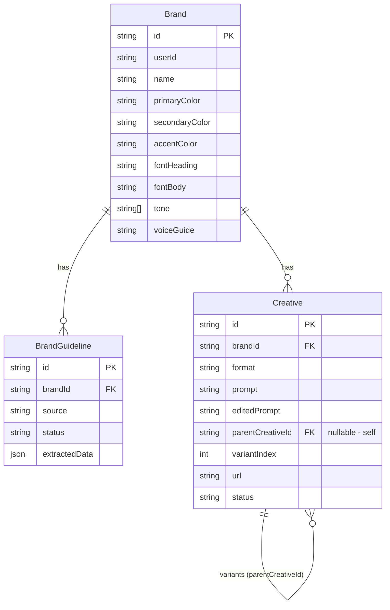
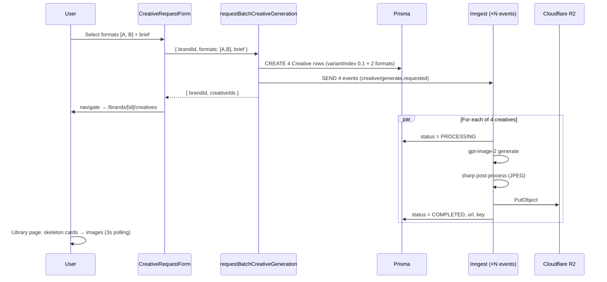
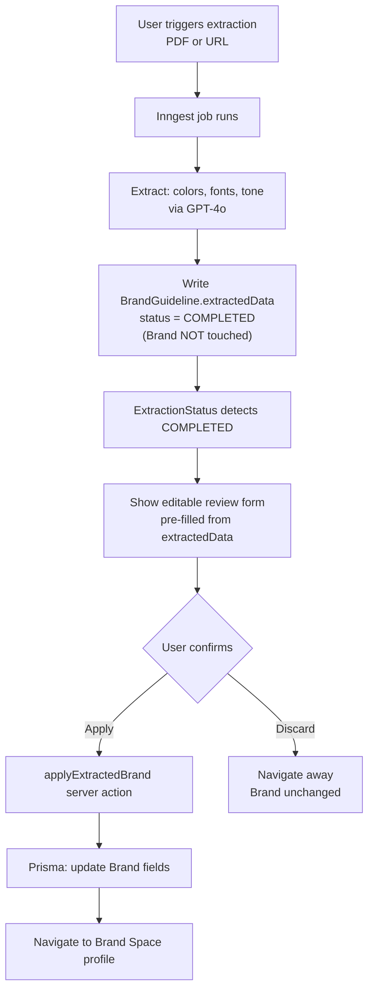

# feat: Brand Alchemist V2 — Product Overhaul

**Date:** 2026-06-06  
**Status:** Active  
**Depth:** Deep

## Summary

A comprehensive product evolution across six workstreams: (1) a new purple-based design system replacing the generic blue; (2) a UI-only "Brand Spaces" rename; (3) richer brand guideline onboarding with user-reviewed extraction and guided self-serve editing; (4) a redesigned creative landing page; (5) a multi-format creative generator with 2 variants per format, prompt-based editing, and multi-format download; and (6) a product logo design direction. The current brand-to-creative pipeline is preserved and extended — no destructive schema changes.

---

## Problem Frame

Four compounding issues motivate this overhaul:

1. **Generic visual identity.** The `indigo-600` color scheme is indistinguishable from hundreds of SaaS tools and actively undermines a "creative product" positioning. All 23 component files hardcode `indigo-*` utilities with no token layer.
2. **Opaque guideline extraction.** PDF and URL extraction auto-applies results directly to the Brand record without user review. Users cannot accept, reject, or correct extracted values before they overwrite existing data.
3. **Underpowered creative generation.** Single-format, single-image generation with no variant exploration, no prompt-based editing, and download only as JPEG. The `Creative` data model has no variant relationship.
4. **Weak landing page.** A 48-line minimal page with no product demo, no social proof, and no creative personality. First impressions do not reflect the product's creative ambition.

---

## Requirements

### Design System
- R1: Replace `indigo-*` utilities with a purple primary + coral accent system defined as CSS custom properties
- R2: All components use semantic color tokens so future palette changes require a single-file edit
- R3: Tailwind v4 `@theme inline` block declares the full palette, auto-generating utility classes

### Brand Spaces
- R4: All user-visible text referring to the user's entity uses "Brand Space" / "Brand Spaces"
- R5: No Prisma schema changes — the `Brand` model stays unchanged in the database

### Brand Guideline Onboarding
- R6: Extraction (PDF and website) must not auto-apply to the Brand record; results must be shown for review and editing before application
- R7: The manual entry and wizard flows include inline guidance: curated preset palettes, tone-of-voice descriptor examples, typography pairing tips, and a live mini preview card
- R8: After extraction completes, the user can edit any extracted field before confirming application
- R9: Existing Brand records with previously applied data are not affected

### Creative Generation
- R10: The generation form allows multi-format selection (checkboxes), with all four current formats available
- R11: Each selected format produces exactly 2 variants
- R12: The `Creative` model supports variant grouping without breaking existing single-creative records
- R13: Users can edit a creative by submitting a revised prompt, which creates a new `Creative` record preserving the original
- R14: Creatives are downloadable in JPG (existing), PNG, and WebP
- R15: Generated creatives must not deviate from brand guidelines — the image generation prompt must always embed the Brand Space's active colors, fonts, and tone

### Landing Page
- R16: Landing page features a dark-mode hero with purple-to-coral gradient, animated preview, and a bento-grid feature section
- R17: Single-scroll narrative structure; no sub-pages linked from the landing nav
- R18: Feel "crafted not generated" — purposeful typography, scroll-triggered reveals, no decoration-for-decoration's-sake animations

### Product Logo
- R19: Document a concrete design direction (concept, geometry, color story, monochrome variants, wordmark, favicon) implementable as an SVG

---

## Key Technical Decisions

**KTD-1: Tailwind v4 `@theme inline` token layer, then global find-replace**
Define `--color-brand-*` and `--color-accent` custom properties in `globals.css` under `@theme inline`. In Tailwind v4, variables declared under `@theme` (or `@theme inline`) in the `--color-*` namespace register as color scale entries and generate utility classes (`--color-brand-600` → `bg-brand-600`, `text-brand-600`). **Implementer must verify this in isolation before the global find-replace**: add one token, confirm `bg-brand-600` generates, then proceed. Fallback if utility generation fails for a custom scale name: use `@utility bg-brand-600 { background-color: var(--color-brand-600); }` blocks, or revert to arbitrary value syntax `bg-[var(--color-brand-600)]`. Alternative (arbitrary values throughout) is less ergonomic and breaks Tailwind intellisense — not chosen as primary path, but documented as the verified fallback. Future palette changes need only `globals.css` in either approach.

**KTD-2: Extraction stops auto-applying; `applyExtractedBrand` becomes the sole write path**
Both Inngest extraction functions currently patch the Brand model in their final step. This step is removed. The final step writes `extractedData` to `BrandGuideline` and sets `status = COMPLETED` only. The existing `applyExtractedBrand` server action (at `app/actions/extract-brand-pdf.ts`) is connected to a new confirmation UI in `ExtractionStatus`. Note: the action currently accepts `Record<string, unknown>` but `updateBrand` in `lib/db/brands.ts` expects `Prisma.BrandUpdateInput` — U3 must fix this type boundary and add a null-field guard (empty strings from the review form must not overwrite existing Brand data). The PDF and website extraction paths produce structurally different `extractedData` shapes (PDF: `{ colors, fonts, voiceKeywords, taglines }`; website: `{ colors, fonts, toneKeywords, tagline, sourceName }`) — the review form in U3 must normalize both into a single editable field set before calling `applyExtractedBrand`.

**KTD-3: Creative variants via `parentCreativeId` + `variantIndex` self-relation**
Add three nullable fields to `Creative`: `parentCreativeId String?` (self-relation), `variantIndex Int @default(0)`, and `editedPrompt String?`. Batch generation creates 2 rows per format with `variantIndex` 0 and 1. Prompt-based editing creates a new row with `parentCreativeId` set to the original. Existing records (both fields null) are unaffected. A separate `CreativeVariant` table was considered but rejected — it would require changing every existing query and add schema complexity without benefit at current scale.

**KTD-4: Batch generation fires N × 2 Inngest events via batch send; navigates to creatives library**
A new `requestBatchCreativeGeneration` server action creates `formats.length × 2` Creative rows in one transaction, fires all events in a single `inngest.send([...events])` batch call (not N sequential `inngest.send()` calls — each is an HTTP round-trip), then returns. The form navigates to `/brands/[brandId]/creatives` (the library). The library page shows pending creatives as skeleton cards via a Client Component polling wrapper (not a Server Component — Server Components cannot poll). The existing `requestCreativeGeneration` action is kept for backward compatibility but removed from the UI.

**KTD-5: Multi-format download via `/api/creatives/[id]/download?format=jpg|png|webp` route**
Rather than generating all three formats at Inngest time (triples R2 storage costs), a route handler fetches the stored JPEG from R2 on demand and converts via `sharp`. Sharp is already a server external package (`next.config.ts`). Response includes `Content-Disposition: attachment`. The R2 JPEG is the source of truth; PNG/WebP are derived on the fly. The alternative (pre-generate all formats) is simpler but 3× storage cost and longer job time — deferred.

**KTD-6: Landing page uses its own dark layout independent of the dashboard**
`app/page.tsx` is already outside the `(dashboard)` route group. The landing page gets inline layout with dark background, larger type scale, and a separate `LandingNav` component. It does not share any dashboard layout. This avoids leaking dashboard styles onto the marketing page.

**KTD-7: Brand Spaces UI rename via `lib/copy.ts` constants**
A new `lib/copy.ts` exports `BRAND_SPACE = 'Brand Space'` and `BRAND_SPACES = 'Brand Spaces'`. All display strings reference these constants. URL segments (`/brands/`, `/brands/[id]`) are unchanged — changing URLs would break bookmarks and is out of scope.

---

## High-Level Technical Design

### Updated Data Model



### Batch Creative Generation Flow



### Brand Guideline Review Flow (Changed)



---

## Scope Boundaries

### In Scope
All nine implementation units described below.

### Deferred to Follow-Up Work
- Dashboard dark mode toggle (landing page dark mode is in scope; dashboard dark mode is not)
- Team / workspace sharing — multiple users on one Brand Space
- Social media direct publishing (generate → post to Instagram/LinkedIn)
- Brand Space version history / audit log
- Adobe Firefly-style variation intensity slider (the simpler prompt-edit flow is in scope instead)
- Pre-generating PNG and WebP at Inngest time (on-demand conversion chosen instead)
- OpenAI file cleanup for processed PDF guidelines (`openaiFileId` currently never deleted)

### Outside This Product's Identity
- General-purpose design canvas (this is brand-first, not canvas-first)
- Asset management DAM with folder hierarchies and team libraries
- Analytics and performance tracking for published creatives
- In-product logo generator for users' own brands (confirmed out of scope)

---

## Implementation Units

### U1. Design System — New Color Palette Tokens

**Goal:** Replace the generic indigo palette with a purple + coral system using Tailwind v4 CSS custom property tokens, applied globally across all components.

**Requirements:** R1, R2, R3

**Dependencies:** None — run first; all other UI units depend on this being done

**Files:**
- `app/globals.css` — extend `@theme inline` with `--color-brand-*` and `--color-accent` vars
- All 23 `.tsx` files containing `indigo-*` utilities (grep: `grep -rl "indigo-" app/ components/`)

**Approach:**
Add to `globals.css` under the existing `@theme inline` block:

```
--color-brand-50:  #faf5ff   (pale lavender — card backgrounds)
--color-brand-100: #f3e8ff
--color-brand-200: #e9d5ff
--color-brand-500: #8b5cf6
--color-brand-600: #7c3aed   (primary action — replaces indigo-600)
--color-brand-700: #6d28d9   (hover state — replaces indigo-700)
--color-brand-900: #4c1d95
--color-accent:    #ff6b6b   (coral CTA — high-energy actions)
--color-accent-hover: #ff5252
```

Tailwind v4 auto-generates `bg-brand-600`, `text-brand-600`, `border-brand-600`, etc. from `--color-brand-*`.

Global find-replace across all component and page files:
- `indigo-600` → `brand-600`
- `indigo-700` → `brand-700`
- `indigo-500` → `brand-500`
- `indigo-50` → `brand-50`
- `indigo-100` → `brand-100`

Do NOT replace `blue-*`, `red-*`, `green-*`, or `gray-*` — those are semantic (processing, error, success, neutral) and stay.

Also fix the Geist font wiring: the `body` rule in `globals.css` currently uses `Arial, Helvetica, sans-serif` despite `--font-geist-sans` being defined. Change `body` to use `font-family: var(--font-geist-sans), sans-serif`.

**Patterns to follow:** Existing `@theme inline` block in `globals.css` — extend it, do not replace the existing `--color-background` and `--color-foreground` entries.

**Test scenarios:**
- Dev server starts with zero Tailwind "unknown utility" warnings
- All primary buttons render in `#7C3AED` violet, not indigo-blue — verify at `/sign-in`, `/brands`, `/brands/new`
- Focus rings render in brand color (test by tabbing through the sign-in form)
- Error states remain red (no change to `red-*` classes)
- `grep -r "indigo-" app/ components/` returns zero results after replacement
- Body text renders in Geist Sans (verify via DevTools computed styles)

**Verification:** Zero Tailwind warnings. Zero `indigo-` occurrences in source. Primary actions are visually purple not blue.

---

### U2. Brand Spaces — UI-Only Rename

**Goal:** Replace all user-facing "Brand" noun labels with "Brand Space / Brand Spaces" without touching Prisma schema or URL structure.

**Requirements:** R4, R5

**Dependencies:** None — parallel with U1

**Files:**
- `lib/copy.ts` — new file; exports `BRAND_SPACE` and `BRAND_SPACES` string constants
- `app/(dashboard)/layout.tsx` — nav link label
- `app/(dashboard)/brands/page.tsx` — page heading
- `app/(dashboard)/brands/[brandId]/page.tsx` — page heading
- `app/(dashboard)/brands/new/page.tsx` — wizard title
- `app/(dashboard)/brands/new/WizardShell.tsx` — step labels and heading
- `app/(dashboard)/brands/new/upload/page.tsx` — page title
- `app/(dashboard)/brands/[brandId]/edit/page.tsx` — edit page heading
- `components/brand/BrandEditForm.tsx` — form labels
- `components/brand-wizard/Step1Identity.tsx` through `Step5Submit.tsx` — step headings

**Approach:**
Create `lib/copy.ts` exporting the two constants. Import `{ BRAND_SPACE, BRAND_SPACES }` in all display-string locations. URL paths (`/brands/`, `/brands/[id]`) are unchanged — no redirects needed.

**Test scenarios:**
- `/brands` heading reads "Your Brand Spaces"
- Wizard step 1 reads "Create a Brand Space"
- Nav link reads "Brand Spaces"
- URL remains `/brands/[id]` — no redirect, no 404
- All existing navigation and form submission still works (functional regression check)
- `grep -rn '\bBrand\b' app/ components/ lib/ --include='*.tsx' --include='*.ts'` returns zero results for the UI string literal noun usage in JSX text and string values (method names, type names, and Prisma model identifiers like `createBrand`, `Brand` type are expected and fine — visually audit ambiguous matches)

**Verification:** Every user-visible noun usage says "Brand Space(s)". All pages and links function correctly.

---

### U3. Brand Guideline — Extraction Review & Edit Flow

**Goal:** Stop Inngest extraction jobs from auto-applying data to the Brand. Show users an editable confirmation form before any Brand fields are written.

**Requirements:** R6, R8, R9

**Dependencies:** None

**Files:**
- `app/inngest/extract-pdf-brand.ts` — remove the final Brand-patching Prisma calls from the last step
- `app/inngest/extract-website-brand.ts` — same removal
- `components/upload/ExtractionStatus.tsx` — add editable review form on `COMPLETED` status; convert to Client Component if not already
- `app/actions/extract-brand-pdf.ts` — fix `applyExtractedBrand` type signature: `Record<string, unknown>` → typed `BrandUpdateFields` shape; add null/empty-string guard before calling `updateBrand`
- `lib/db/brands.ts` — add `getGuidelineData(guidelineId)` query that returns `extractedData` alongside status; fix `updateBrand` to accept the new typed input
- `app/(dashboard)/brands/[brandId]/page.tsx` — add "Extraction awaiting review" banner when any BrandGuideline for this brand has `status = COMPLETED` and `extractedData` is non-null; link banner to the extraction review URL

**Approach:**

**Inngest changes:** In both extraction functions, the final step that patches `Brand` fields (`prisma.brand.update(...)`) is deleted. The step still writes `BrandGuideline.extractedData` and sets `status = COMPLETED`. The `BrandGuideline` record holds the data; the `Brand` is untouched until the user confirms.

**`extractedData` schema normalization:** PDF extraction produces `{ colors, fonts, voiceKeywords, taglines }`; website extraction produces `{ colors, fonts, toneKeywords, tagline, sourceName }`. The review form must normalize both into a canonical `ReviewableExtraction` shape before rendering:
```
{ primaryColor, secondaryColor, accentColor, fontHeading, fontBody, tone: string[], tagline: string | null }
```
Add a `normalizeExtractedData(raw: unknown, source: 'pdf' | 'url'): ReviewableExtraction` utility function in `lib/extraction.ts`.

**`ExtractionStatus` component:** Currently auto-redirects to brand profile on `COMPLETED`. Change to:
1. Call `getGuidelineData(guidelineId)` to fetch `extractedData` and `source`
2. Normalize via `normalizeExtractedData(extractedData, source)`
3. Render an editable form pre-populated from the normalized shape:
   - Color swatches with hex inputs (3 colors max)
   - Font name text inputs (heading + body)
   - Tone keyword pills (multi-select, matches the wizard Step4 pattern)
   - Optional tagline text input
4. Two buttons: "Apply to Brand Space" → calls `applyExtractedBrand(brandId, editedData)` → navigates to brand profile; "Discard" → navigates to brand profile without calling anything
5. The form mirrors `StructuredAssetUpload`'s field layout for visual consistency

**Handling navigation-away:** If the user navigates away from `ExtractionStatus` before confirming, the `BrandGuideline` stays at `COMPLETED` with `extractedData` populated. The brand profile page (`/brands/[brandId]`) must show a persistent banner: "You have extracted brand data awaiting review." with a link to return to the upload/extraction page. This is the re-entry path — it prevents silent data loss. Add a server-side check in the brand profile page: `prisma.brandGuideline.findFirst({ where: { brandId, status: 'COMPLETED', NOT: { extractedData: null } } })`.

**`applyExtractedBrand` fix:** Replace the `Record<string, unknown>` parameter type with the canonical `ReviewableExtraction` type. Strip empty strings before calling `updateBrand` — only include fields where the value is a non-empty string or non-empty array.

**Test scenarios:**
- After PDF extraction completes, user sees editable form (not redirected to brand profile automatically)
- After URL extraction completes, same editable form with correctly normalized fields (toneKeywords → tone array, sourceName dropped)
- User edits `primaryColor` in the form, clicks Apply → `Brand.primaryColor` is updated to the edited value in the database
- User clears the `fontHeading` field and clicks Apply → `Brand.fontHeading` is NOT overwritten with an empty string (empty-string guard applies)
- User clicks Discard → brand profile loads → `Brand.primaryColor` is unchanged
- If `extractedData` has no `fontHeading`, the font heading field is empty (not null-crashing)
- Existing Brand records with previously applied data are unaffected (no migration needed)
- Extraction failure (status = FAILED) still shows error message — unchanged
- User triggers extraction, then navigates directly to `/brands/[brandId]` → brand profile shows "awaiting review" banner
- User clicks banner → taken back to the extraction review form
- Covers R6: Brand is not patched until user explicitly confirms
- Covers R9: existing data is not retroactively affected

**Verification:** Trigger a website extraction. Completion screen shows the editable form with normalized fields. Apply updates Brand in DB (verify via Supabase Studio). Navigate away mid-flow — brand profile shows review banner.

---

### U4. Brand Guideline — Onboarding Guidance & Recommendations

**Goal:** Add contextual guidance, curated presets, and a live mini-preview to the brand setup wizard and manual entry flow.

**Requirements:** R7

**Dependencies:** U3 (review form uses the same field layout; guidance is added to it too), U1 (brand color tokens must exist for the preview card)

**Files:**
- `components/brand-wizard/Step2Colors.tsx` — add 6 curated preset palette options
- `components/brand-wizard/Step3Typography.tsx` — add 3 typography pairing examples
- `components/brand-wizard/Step4Tone.tsx` — add example copy sentences per tone keyword
- `components/brand-wizard/Step5Submit.tsx` — add live mini Brand Space preview card
- `components/upload/StructuredAssetUpload.tsx` — add help text to each field group

**Approach:**

**Step2Colors — Palette presets:**
Add a horizontal row of 6 curated preset options above the color pickers. Each preset is a 3-swatch strip (primary, secondary, accent) with a name ("Bold Studio", "Earth Creative", "Tech Minimal", "Neon Pop", "Warm Editorial", "Monochrome Edge"). Clicking a preset fills the three hex input fields. Presets are hardcoded constants in the component — no API calls. Individual color pickers remain fully functional.

**Step3Typography — Pairing examples:**
Show 3 pairing cards in a horizontal strip, each rendering sample text at two sizes using `font-family` inline styles (no Google Fonts import — use system fonts that approximate the personality):
- "Editorial: Playfair / Inter — Classic and authoritative"
- "Modern: DM Sans / DM Sans — Clean and confident"
- "Friendly: Nunito / Open Sans — Warm and approachable"
Clicking a card fills the heading/body font name fields. The user can override with any font name.

**Step4Tone — Descriptor examples:**
Each tone keyword pill (Professional, Playful, Bold, Minimalist, Warm, Edgy, Luxury, Casual) shows a one-sentence micro-copy example when selected. Example appears in a small callout below the pills: "Playful: 'We turned your boring Monday into a design party 🎉'". Implemented as a `Record<string, string>` map in the component.

**Step5Submit — Live preview card:**
A small (~220px wide) social card thumbnail showing:
- Background: `linear-gradient(135deg, primaryColor, secondaryColor)` using the wizard's current `values`
- Brand name centered in `fontHeading` (inline style, no actual font load)
- Tagline below in `fontBody` weight
- White text on dark gradient

This is a pure CSS/HTML preview — no image generation. Updates reactively as the user changes values in earlier steps (wizard `values` prop already propagates changes).

**`StructuredAssetUpload` help text:** Add a short helper paragraph above each field group (colors, fonts, tone). Example for colors: "Tip: Your primary color should be the most recognizable — it appears on buttons and headlines."

**Test scenarios:**
- Clicking a palette preset fills all three color fields with the preset's values
- Tone keyword example text appears on selection and disappears on deselection
- Mini preview card updates when `primaryColor` changes in Step 2 (end-to-end wizard state flow)
- Typography pairing selection fills the font name fields
- No network requests are made when clicking presets (all data is hardcoded)
- StructuredAssetUpload renders help text for colors, fonts, and tone sections

**Verification:** Wizard Steps 2, 3, 4, 5 have visible guidance. Preset palette fills inputs. Preview card shows user's colors. No API calls during wizard interactions.

---

### U5. Creative Schema Migration — Variant Support

**Goal:** Add `parentCreativeId`, `variantIndex`, and `editedPrompt` fields to the `Creative` model to support grouped variants and non-destructive prompt editing.

**Requirements:** R12, R13

**Dependencies:** None — run before U6 and U7

**Files:**
- `prisma/schema.prisma` — add three fields and self-relation to `Creative`
- `prisma/migrations/` — new migration generated by `prisma migrate dev`

**Approach:**
Add to the `Creative` model:

```
parentCreativeId  String?
parent            Creative?  @relation("CreativeVariants", fields: [parentCreativeId], references: [id], onDelete: SetNull)
variants          Creative[] @relation("CreativeVariants")
variantIndex      Int        @default(0)
editedPrompt      String?
```

`onDelete: SetNull` ensures that if a parent creative is deleted, variant records lose their `parentCreativeId` reference rather than cascading. Existing records: all three new fields default to null/0 — no data loss.

After adding fields, run: `npx prisma migrate dev --name creative-variants`

**Test scenarios:**
- `prisma migrate dev` completes without error against the Supabase database
- Existing Creative records survive migration: `parentCreativeId = null`, `variantIndex = 0`, `editedPrompt = null`
- Prisma client generates correct TypeScript types (`creative.parentCreativeId: string | null`, `creative.variantIndex: number`)
- Self-relation query `prisma.creative.findMany({ include: { variants: true } })` executes without error
- Deleting a parent Creative record sets `parentCreativeId = null` on all its variants (verify `onDelete: SetNull` behaviour via Supabase Studio after a direct delete)

**Verification:** Migration succeeds. Supabase Studio shows three new columns on the Creative table with correct defaults. Parent deletion sets variant `parentCreativeId` to null rather than cascading.

---

### U6. Creative Generation — Multi-Format Batch with 2 Variants

**Goal:** Replace single-format single-image generation with multi-format checkbox selection that always produces 2 variants per format.

**Requirements:** R10, R11, R14, R15

**Dependencies:** U5 (schema), U3 (so Brand data is accurate after guided extraction)

**Files:**
- `app/actions/creatives.ts` — add `requestBatchCreativeGeneration` server action
- `components/creatives/CreativeRequestForm.tsx` — replace radio select with checkboxes; update submit
- `app/(dashboard)/brands/[brandId]/creatives/new/page.tsx` — pass full brand object to form
- `lib/prompts.ts` — strengthen `buildPrompt` to always embed brand colors, fonts, and tone; add `buildBrandSystemContext` helper
- `app/inngest/generate-creative.ts` — no changes needed (one event per image)

**Approach:**

**`requestBatchCreativeGeneration` server action:**
1. Validate `{ brandId, formats: CreativeFormat[], brief?: string }` — Zod enum array, min length 1
2. Fetch brand via `getBrand(brandId)` — includes all color/font/tone fields
3. For each format × variant index [0, 1]:
   - Call `buildPrompt(brand, format, brief, variantIndex)` — variant index 1 appends "alternative composition, different layout angle" to encourage visual diversity
   - Create a `Creative` row (`status: PENDING`, `variantIndex`, `prompt`)
4. Fire one Inngest event per row
5. Return `{ brandId, count: formats.length * 2 }` — form navigates to `/brands/[brandId]/creatives`

**`buildBrandSystemContext` in `lib/prompts.ts`:**
Assembles a brand context string included in every image generation prompt:
```
Brand colors: primary #[hex], secondary #[hex], accent #[hex].
Brand tone: [tone.join(', ')].
Voice/mood: [voiceGuide if present].
Use ONLY these colors. Do not introduce colors not listed above.
```
Color and tone are prompt-enforceable. Font names are NOT included — the existing prompt instructs gpt-image-2 to produce no text in the image (`"Do not render any text or typography in the image"`), so specifying `fontHeading` and `fontBody` would contradict that directive and be silently ignored. R15 fidelity applies to visual color palette and brand mood only; typographic fidelity on image-only output is not achievable via prompt engineering and is explicitly deferred. If font-accurate text overlay becomes a requirement, it is a post-generation compositing step (sharp + canvas), not a prompt change.

**`CreativeRequestForm` UI changes:**
- Four format checkboxes in a 2×2 grid (replacing the radio buttons)
- Validation: at least one format selected
- Button label: "Generate [n] creatives" (n = selectedFormats.length × 2, updates live)
- No change to brief textarea

**Test scenarios:**
- Selecting 2 formats creates exactly 4 Creative rows in the database (`variantIndex` 0 and 1 for each format)
- Each Creative row has a non-null `prompt` that includes hex color values from the Brand record
- Selecting 0 formats shows a validation error; form does not submit
- Selecting all 4 formats creates 8 Creative rows and fires 8 Inngest events
- After submission, user is navigated to `/brands/[brandId]/creatives`
- The assembled prompt for `variantIndex = 1` differs from `variantIndex = 0` (contains the alternative composition suffix)
- Covers R15: grep the saved `Creative.prompt` — it must contain the Brand's `primaryColor` hex value

**Verification:** Submit with 2 formats. DB shows 4 Creative rows. Inngest dev dashboard shows 4 queued events. Library page loads.

---

### U7. Creative Results — Grid Display, Prompt Editing, Multi-Format Download

**Goal:** Show generated creatives as a responsive grid with skeleton loaders for pending items; support prompt-based editing that creates a new variant; enable download in JPG/PNG/WebP.

**Requirements:** R13, R14

**Dependencies:** U5, U6

**Files:**
- `app/(dashboard)/brands/[brandId]/creatives/page.tsx` — becomes a thin Server Component that fetches initial creative list and passes to `CreativesGrid`
- `components/creatives/CreativesGrid.tsx` — new Client Component (`'use client'`); owns the skeleton-to-image reveal + 3s polling loop via `setInterval` + `router.refresh()` or a `useCreatives` hook calling a server action
- `components/creatives/CreativeCard.tsx` — add download format dropdown
- `components/creatives/CreativeViewer.tsx` — add prompt editing textarea + "Generate variation" button
- `app/actions/creatives.ts` — add `editCreativePrompt` server action; add `getCreativesForBrand` server action (for client-side polling)
- `app/api/creatives/[id]/download/route.ts` — new route: fetch R2 JPEG via `GetObjectCommand`, convert via sharp, stream; import `GetObjectCommand` from `@aws-sdk/client-s3`
- `lib/db/creatives.ts` — extend `getCreatives` to include `variantIndex`, `parentCreativeId`, **and `key`** (the R2 object key); existing queries that omit `key` must be updated to include it for the download route

**Approach:**

**Library page (Server + Client split):** `page.tsx` is a Server Component — it fetches the initial creative list with `prisma.creative.findMany(...)` and renders `<CreativesGrid initialCreatives={...} />`. `CreativesGrid` is a Client Component that:
1. Holds `creatives` in `useState`, initialized from `initialCreatives`
2. Runs a `setInterval(async () => { const fresh = await getCreativesForBrand(brandId); setCreatives(fresh); }, 3000)` in `useEffect`
3. Clears the interval when all visible creatives are in a terminal status (`COMPLETED` or `FAILED`)
4. PENDING/PROCESSING creatives render as skeleton cards — gray animated-pulse placeholder with the correct aspect ratio for the format (1:1 for Instagram Square, 9:16 for Story, etc.)
5. COMPLETED creatives render with a `transition-opacity` + `scale` CSS transition on mount (opacity 0→1, scale 0.97→1, 300ms ease-out)

**Prompt editing in `CreativeViewer`:** Below the image, add a collapsible "Refine this creative" section containing:
- Textarea pre-populated with `creative.editedPrompt ?? creative.prompt`
- "Generate variation" button → calls `editCreativePrompt(creativeId, newPrompt)`

`editCreativePrompt` server action:
1. Fetch the parent creative and verify user owns it
2. Create a new Creative with `parentCreativeId = creativeId`, `variantIndex = parent.variants.length`, `prompt = newPrompt`, `editedPrompt = newPrompt`, same `format` and `brandId`
3. Fire Inngest event
4. Return `{ newCreativeId }` → client navigates to `/brands/[brandId]/creatives/[newCreativeId]`

**Download route (`app/api/creatives/[id]/download/route.ts`):**
- `GET /api/creatives/[id]/download?format=jpg|png|webp`
- Auth: call `getCurrentUser()`, verify the creative's brand `userId` matches
- Fetch the JPEG from R2 using `GetObjectCommand` with the stored `key`
- `format=jpg`: stream as-is with `Content-Type: image/jpeg`
- `format=png`: pipe through `sharp().png()`; `Content-Type: image/png`
- `format=webp`: pipe through `sharp().webp({ quality: 90 })`; `Content-Type: image/webp`
- Always set `Content-Disposition: attachment; filename="creative-[id].[format]"`

Download UI: Replace the existing `<a href={url} download>` with a dropdown button offering JPG / PNG / WebP options. Each option is an anchor tag linking to the download route.

**Test scenarios:**
- Library page: PENDING creative shows skeleton card; skeleton disappears when status reaches COMPLETED
- Skeleton card aspect ratio matches the creative's format (1:1 for INSTAGRAM_SQUARE)
- Fade-in transition plays once when creative status transitions to COMPLETED
- Clicking "Generate variation" with an edited prompt creates a new Creative in DB with `parentCreativeId` set
- Download route: `GET /api/creatives/[id]/download?format=png` returns `Content-Type: image/png` and `Content-Disposition: attachment`
- Download route: requesting a creative owned by another user returns 403 (unauthorized)
- Download route: `format=webp` returns `Content-Type: image/webp`
- Polling stops once all visible creatives reach COMPLETED or FAILED status

**Verification:** Library shows 4 skeletons after batch submit; they resolve to images as jobs complete. Download route returns the correct file format. Prompt editing creates a new Creative and navigates to it.

---

### U8. Landing Page Redesign

**Goal:** Replace the minimal 48-line landing page with a crafted dark-mode page that communicates the product's creative identity.

**Requirements:** R16, R17, R18

**Dependencies:** U1 (brand color tokens), U2 (Brand Spaces label)

**Files:**
- `app/page.tsx` — full rewrite; new dark layout
- `components/landing/LandingNav.tsx` — new component: transparent-over-dark nav
- `components/landing/HeroSection.tsx` — new component: gradient orb + headline + CTAs
- `components/landing/FeatureBento.tsx` — new component: 3-column bento grid
- `components/landing/SocialProofStrip.tsx` — new component: example creatives strip

**Approach:**

**Color:** Background `#0D0117` (near-black purple tint). Primary brand purple `#7C3AED` for gradients and active elements. Coral `#FF6B6B` for the primary CTA button. Text: white and `rgba(255,255,255,0.6)` for secondary.

**Single-scroll layout:**

1. **`LandingNav`** — position: sticky top-0, backdrop blur, transparent until scroll. Logo mark (flask SVG from U9 spec) + wordmark left. "Sign in" (ghost) and "Get started free" (coral) right. No sub-navigation.

2. **`HeroSection`** — Full-viewport height. Large centered headline: **"Your brand. Every format. Always on-brand."** (Geist Sans, `text-5xl md:text-7xl`, `font-bold`, `tracking-tight`, white). Subtext line in `rgba(255,255,255,0.6)`. CTA row: "Start free" coral button + "See how it works" ghost link. Behind the copy: a CSS `radial-gradient` orb from `#7C3AED` through `#FF6B6B` to transparent — positioned at top-center, large (600×600px), `opacity: 0.4`, `pointer-events: none`. No image dependency.

3. **`FeatureBento`** — Padding section below the hero. 4-cell grid: 2 cells wide × 2 cells (3-column layout with one spanning cell on desktop). Cards have a `#1A0030` background (slightly lighter than page bg), `border: 1px solid rgba(255,255,255,0.1)`, `border-radius: 16px`. Cards: "Brand DNA" (colors, fonts, tone in one place), "Three ways in" (upload PDF, paste URL, enter manually), "Generate in seconds" (multi-format output), "Every format covered" (Instagram, LinkedIn panels). Each card has a 1-line headline, 1-sentence description, and a small abstract icon or CSS gradient strip as a visual.

4. **`SocialProofStrip`** — Horizontal overflow-x scroll strip of 6 static example creative thumbnails. Each is a CSS gradient card (no real images required for launch) with a brand name caption in small text. Shows the variety of outputs: different colors, different formats.

**Animations:** Use `IntersectionObserver` in a `'use client'` wrapper component. On entering viewport: `opacity 0 → 1`, `translateY 20px → 0`, 400ms ease-out. Applied to the bento grid and social proof strip. Hero is visible on load — no entry animation for the above-the-fold content (best practice: don't animate what the user sees first).

**Test scenarios:**
- Page renders correctly at 1440px with all four sections visible
- Page is responsive at 375px (single column, headline wraps to 2–3 lines)
- "Get started free" CTA navigates to `/sign-up`
- "Sign in" navigates to `/sign-in`
- Scroll-triggered animation fires once per section on first entry into viewport
- Page has no layout shift (gradient orb is CSS, not an image loading)
- Page does not leak dashboard layout styles (verify `(dashboard)/layout.tsx` is NOT wrapping this page)
- Lighthouse: no render-blocking resources in the hero

**Verification:** `http://localhost:3000` shows dark hero with gradient orb, bento grid, and social proof strip. CTAs work. Responsive at 375px.

---

### U9. Product Logo Design Direction

**Goal:** Document a complete, implementable design specification for the Brand Alchemist product logo as an SVG.

**Requirements:** R19

**Dependencies:** U1 (palette defined before logo spec references it)

**Files:**
- `docs/brand/logo-spec.md` — new file: complete logo specification
- `app/layout.tsx` — update `metadata.icons` config once SVG is produced (placeholder for implementer)
- `public/` — logo SVG files are created by the implementer following this spec (not during this plan unit)

**Approach:**

The specification document covers:

**Concept:** An alchemist's flask (round-bottom flask / retort) — the universal symbol of transformation. The flask silhouette is minimal and geometric (works at 16px). The flask body contains a `135°` diagonal gradient from `#7C3AED` (purple) to `#FF6B6B` (coral) — raw brand identity transformed into something vivid.

**Geometry (SVG construction):**
- Outer viewBox: `0 0 40 40` (1:1 mark)
- Flask body: a circle centered at `(20, 26)` radius `12`
- Flask neck: a rectangle `(16, 8)` to `(24, 16)` — connecting to the circle top
- Flask mouth: a short horizontal bar at top `(14, 8)` to `(26, 8)`, height `2px`, `border-radius: 1px`
- Gradient fill (`linearGradient id="brand"`, `x1=0 y1=0 x2=1 y2=1`): `stop #7C3AED at 0%`, `stop #FF6B6B at 100%`
- All elements share a single path via `clip-path` for crisp rendering at small sizes

**Monochrome variants:**
- Dark backgrounds: white fill (`#FFFFFF`)
- Light backgrounds: `#7C3AED` solid fill (no gradient)
- Favicon: gradient flask mark only, no wordmark

**Wordmark:** "Brand" in Geist Sans Medium weight + "Alchemist" in Geist Sans Light weight. Set immediately right of the flask mark with `8px` gap. The weight contrast ("Brand" heavier) reinforces that brand is the noun — the product name hierarchy.

**Clear space:** Minimum padding equal to `1×` the flask height on all sides (40px of the 40px viewBox = 40px clear space for a 40px rendered mark).

**Minimum size:** 24px height for the mark (flask alone). At smaller sizes, use a simplified version with 2px stroke weight only (no gradient fill — too fine to render).

**Test scenarios:**
- Test expectation: none — U9 is a design direction document. The SVG implementation is a follow-up task once the spec is reviewed.

**Verification:** `docs/brand/logo-spec.md` exists and contains all six components: concept rationale, geometry description (with SVG coordinate guidance), color story, monochrome variants, wordmark typography, and favicon treatment.

---

## Risks & Dependencies

| Risk | Likelihood | Impact | Mitigation |
|------|-----------|--------|------------|
| Tailwind v4 `@theme inline` does not auto-generate `bg-brand-600` from `--color-brand-600` | Low | High | Test token generation in isolation before the global find-replace. Fallback: use `bg-[var(--color-brand-600)]` arbitrary value syntax throughout. |
| `sharp` PNG/WebP conversion in the download route exceeds Vercel serverless memory on large images | Low | Medium | gpt-image-2 JPEG output is ~2–4MB; PNG expansion is ~3×. Configure the download function with `export const maxDuration = 30` and 512MB memory in `next.config.ts`. |
| Removing auto-apply from Inngest breaks in-flight extraction jobs at deploy time | Low | Low | In-flight jobs at deploy write `extractedData` correctly and set `COMPLETED` — they simply no longer patch Brand. Existing Brand data is unaffected. |
| gpt-image-2 ignores hex color constraints in the prompt (R15 fidelity risk) | Medium | High | Include colors both as hex and descriptive language. Test prompt effectiveness before shipping U6. If fidelity is insufficient, explore post-generation color analysis and feedback loop as a follow-up. Font names explicitly excluded from the prompt (contradicts no-text directive). |
| 8 simultaneous Inngest events (4 formats × 2 variants) hitting function concurrency limits | Low | Low | Inngest default concurrency is 10 per function. 8 simultaneous events is within limits. Local dev server has no concurrency limit. |
| Tailwind v4 `@theme inline` does not generate utility classes for custom scale names like `brand` | Medium | High | Verify in isolation before global find-replace (U1). Fallback: `@utility` blocks or arbitrary values `bg-[var(--color-brand-600)]` — documented in KTD-1. |
| Users navigate away from `ExtractionStatus` mid-flow, losing extracted data silently | Medium | Medium | Brand profile page shows persistent "awaiting review" banner when a BrandGuideline has `COMPLETED` status with non-null `extractedData`. Covered in U3 scope. |

---

## Sources & Research

External research was load-bearing for KTD-1 (palette selection), U8 (landing page architecture), and U7 (creative results UX pattern).

- Looka wizard UX — gate question + style quiz before generation; preset palettes before color pickers
- Midjourney 2×2 grid + Vary button — proven creative results display pattern at scale
- Adobe Firefly Precision Flow — variation intensity slider (noted; deferred from this plan)
- Purple `#7C3AED` as primary: unoccupied by direct competitors (Canva, Adobe Express use blue; Jasper uses dark navy); confirmed across 4 independent color psychology sources as "innovation + creativity" signal
- Coral `#FF6B6B` accent: Pantone 2025 warm trend alignment + high contrast against purple confirmed
- Framer / Linear landing page pattern: dark hero + CSS gradient orb + bento grid + single-scroll narrative
- Nielsen Norman Group: skeleton loaders reduce perceived wait ~40% vs spinners — applied to U7 library page
- Jasper Brand Voice IQ — brand as persistent config object; informs R15 prompt engineering approach in U6
